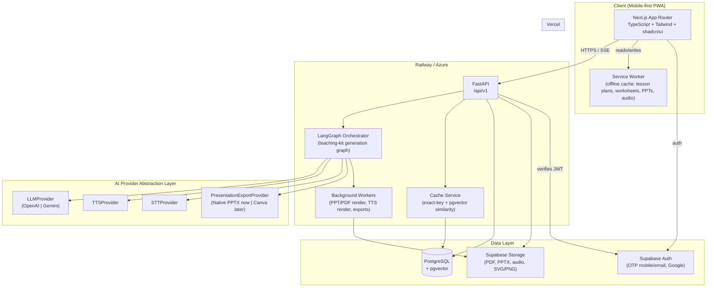

# System Architecture

## 1. High-level diagram



## 2. Frontend

**Next.js (App Router) + TypeScript + Tailwind + shadcn/ui.**

- **Routing**: route groups `(auth)`, `(dashboard)` — dashboard group holds the top-nav shell (Search, Library, My Resources, Saved Lessons, Worksheets, Analytics, Settings).
- **State**: React Query owns all server state (teaching-kit requests, resource polling/streaming, library lists) with cache keys mirroring the backend cache key so client and server caching philosophy match. Zustand owns small local/UI state only: active language, active teaching mode, generation-form draft, voice-recording state. Nothing that can be derived from the server belongs in Zustand.
- **Forms**: React Hook Form + Zod for the generation form (class/subject/chapter/language/duration) and admin forms — client-side validation mirrors the Pydantic schemas on the backend (schema definitions are hand-kept in sync via `packages/shared-types`, see [04-folder-structure.md](04-folder-structure.md)).
- **Motion**: Framer Motion reserved for: progressive resource-card reveal during generation, tab transitions in the teaching-kit result view, mic pulse animation during voice input. Not used decoratively elsewhere — this audience is low-bandwidth and motion-averse UIs read as more trustworthy for a "serious tool," not less.
- **i18n**: `next-intl` for UI chrome strings (en / hi / hinglish message bundles under `apps/web/messages/`). Generated *content* language is a separate concern — see §5.
- **PWA**: `next-pwa` (or hand-rolled service worker) — see §6.

## 3. Backend

**Python + FastAPI**, versioned under `/api/v1`.

- **Pydantic** for all request/response schemas — one schema module per resource type, shared field definitions for the (class, subject, chapter, language, duration, teaching_mode) generation params used everywhere as the cache key input.
- **LangGraph** owns the teaching-kit generation pipeline as a graph, not a linear function chain:
  - Node: `check_cache` (per resource type, fan-out)
  - Node: `generate_lesson_plan`, `generate_teaching_script`, `generate_blackboard_notes`, `generate_local_context`, `generate_activities`, `generate_questions`, `generate_pyq`, `generate_worksheet`, `generate_mindmap`, `generate_audio_script` → `render_audio`, `generate_ppt_outline` → `render_ppt`
  - Each generation node depends on `generate_lesson_plan` completing first (it's the shared source of truth for objectives/core concepts that every other resource references), then fans out in parallel.
  - Edge: on cache hit, node short-circuits straight to `persist_and_stream` without calling any LLM/TTS/export provider.
  - Terminal node streams each finished resource back to the API layer as it completes (SSE), rather than waiting for the whole graph.
- **Background workers** handle anything slow/CPU-bound that shouldn't block the request-response cycle: PPTX rendering (python-pptx), PDF rendering (worksheets, PPT-to-PDF), audio file finalization/upload. LangGraph nodes enqueue work; workers write results to Supabase Storage and update Postgres; SSE stream picks up completion via DB polling or a lightweight pub/sub (Postgres `LISTEN/NOTIFY` is sufficient at this scale — no need for Kafka/Redis pub-sub yet).

## 4. AI provider abstraction layer

Every external creative-AI dependency sits behind an interface defined in `apps/api/app/ai/providers/*/base.py`. This is the single most important architectural discipline in the system, because the spec explicitly requires (a) LLM vendor flexibility, (b) Canva as a *future* integration without a rewrite, and (c) video generation to be a dead stub today but a live provider tomorrow.

```python
class LLMProvider(Protocol):
    async def generate(self, prompt: str, *, language: Language, response_schema: type[BaseModel]) -> BaseModel: ...

class TTSProvider(Protocol):
    async def synthesize(self, script: str, *, language: Language, duration_target_sec: int) -> AudioAsset: ...

class STTProvider(Protocol):
    async def transcribe(self, audio: bytes, *, language_hint: Language | None) -> str: ...

class PresentationExportProvider(Protocol):
    async def export(self, slides: SlideDeck, *, format: Literal["pptx", "pdf", "canva"]) -> ExportedFile: ...
```

- `SlideDeck` (the structured intermediate representation produced by `generate_ppt_outline`) is provider-agnostic: ordered slides, each with a layout type (`title`, `bullets`, `diagram`, `image+caption`), text runs, and speaker notes. `NativePptxExportProvider` (python-pptx, v1) and a future `CanvaExportProvider` both consume the same `SlideDeck` — Canva integration becomes "implement one adapter + call Canva's Autofill/Connect API with this JSON," never a change to the generation graph.
- `VideoGenerationProvider` interface exists in code with **zero implementations** and a `NotImplementedError` — the frontend's "Coming Soon" video button calls a route that 501s by design, so re-enabling later is a config flip + one adapter, not new plumbing.
- Provider selection (OpenAI vs Gemini, which model) is a config value (`LLM_PROVIDER=openai|gemini`), read once at startup, injected via FastAPI `Depends`.

## 5. Bilingual generation

Language (English / Hindi / Hinglish) is a **generation parameter**, not a translation post-process. The prompt templates in `apps/api/app/ai/prompts/` are parameterized by language and instruct the model to *think and write natively* in the target register (Hinglish specifically means code-mixed Roman-script output matching how Bihar teachers actually speak, not a literal translation) — this is called out explicitly because naive translation of an English lesson script into Hindi consistently produces stiff, textbook-register output that fails the "actual teaching script, not textbook explanation" requirement. Each of the three languages is generated as its own independent LLM call/cache entry, not derived by translating one canonical version.

## 6. Caching strategy (mandatory, see [02-database-schema.md](02-database-schema.md))

Two layers:

1. **Exact-match cache** — `resource_cache` keyed by a deterministic hash of `(class, subject, chapter, language, duration, teaching_mode, resource_type, resource-specific params e.g. difficulty/version)`. Checked first, O(1) lookup, zero AI cost on hit. This is the primary mechanism — expected hit rate is high given the finite, shared BSEB/NCERT curriculum.
2. **Semantic near-match (pgvector)** — for free-text search queries that don't map cleanly onto a canonical (class, subject, chapter) triple (e.g. two teachers phrasing the same request differently), embed the normalized query and check cosine similarity against previously-resolved queries above a threshold before falling back to a fresh curriculum-lookup + generation. This is what makes "How should I teach photosynthesis" and "Class 7 ke students ko photosynthesis kaise padhaun" resolve to the same cached kit when they mean the same chapter.

Cache entries track `hit_count` and `last_used_at` for the analytics dashboard's "most requested topics" view and to inform pre-warming (see Phase 7 in [07-roadmap.md](07-roadmap.md)).

## 7. Offline / PWA

- Service worker precaches the app shell; runtime-caches (stale-while-revalidate) any teaching-kit resource the teacher has opened, using Cache Storage for JSON/HTML content and IndexedDB references to Supabase Storage blob URLs for PDFs/PPTX/audio actually downloaded.
- "Save for offline" is an explicit teacher action per kit (not automatic for everything they've ever viewed) to keep storage bounded on low-end Android devices.
- Generation itself requires connectivity (it's a live AI call); offline support covers *consuming already-generated resources* and *queuing a generation request* to fire once connectivity returns — not offline generation.

## 8. Auth & authorization

- Supabase Auth (mobile OTP, email OTP, Google) issues a JWT; FastAPI verifies it on every request (`Depends(get_current_user)`), then loads the app-level `users` row (role, school_id, preferred_language) from Postgres — Supabase auth identity and app user profile are linked by `supabase_auth_id`, kept as two tables rather than overloading Supabase's `auth.users`, so app-specific fields don't fight Supabase-managed columns.
- Authorization is role-based (`teacher`, `school_admin`, `super_admin`) enforced via a FastAPI dependency per router, not scattered `if` checks — see [03-api-design.md](03-api-design.md#authorization).

## 9. Deployment

- **Frontend**: Vercel (Next.js native fit, edge caching for static/PPR-eligible routes).
- **Backend**: Railway (default) or Azure — chosen per environment via the same Dockerfile; no Railway/Azure-specific code paths. Background workers run as a second Railway/Azure service (or a `--workers` process pool) from the same image, not a separate codebase.
- **Database**: managed Postgres with pgvector extension enabled (Supabase's own Postgres is the natural choice here, keeping auth+storage+DB on one provider for the prototype, with the option to split to a dedicated Postgres later since nothing in the schema is Supabase-proprietary).
