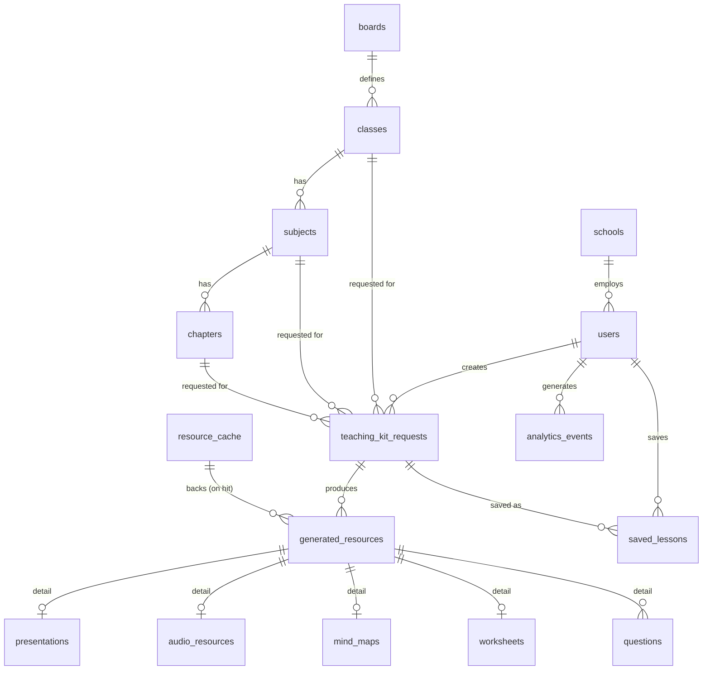

# Database Schema (PostgreSQL + pgvector)

Conventions: every table has `id uuid primary key default gen_random_uuid()`, `created_at timestamptz default now()`. Soft-delete via `deleted_at timestamptz null` on user-facing tables (schools, users, saved_lessons) so nothing government-audit-relevant is hard-deleted; content tables (generated resources) don't soft-delete — they're cache entries, not records of truth.

## 1. Identity & org

```sql
create table schools (
  id uuid primary key default gen_random_uuid(),
  name text not null,
  udise_code text unique,              -- govt school identifier, nullable until verified
  state text not null default 'Bihar', -- kept generic for multi-state future
  district text,
  block text,
  created_at timestamptz default now(),
  deleted_at timestamptz
);

create type user_role as enum ('teacher', 'school_admin', 'super_admin');
create type app_language as enum ('en', 'hi', 'hinglish');

create table users (
  id uuid primary key default gen_random_uuid(),
  supabase_auth_id uuid not null unique,   -- FK to Supabase auth.users, cross-schema
  name text not null,
  phone text unique,
  email text unique,
  role user_role not null default 'teacher',
  school_id uuid references schools(id),
  preferred_language app_language not null default 'hi',
  created_at timestamptz default now(),
  deleted_at timestamptz
);
create index idx_users_school on users(school_id);
```

## 2. Curriculum catalog (reference data, seeded per state/board)

```sql
create table boards (            -- BSEB, CBSE, NCERT-aligned, etc.
  id uuid primary key default gen_random_uuid(),
  name text not null,
  state text not null default 'Bihar'
);

create table classes (           -- "Class 6".."Class 12"
  id uuid primary key default gen_random_uuid(),
  board_id uuid references boards(id) not null,
  grade smallint not null,
  display_name text not null
);

create table subjects (
  id uuid primary key default gen_random_uuid(),
  class_id uuid references classes(id) not null,
  name text not null
);

create table chapters (
  id uuid primary key default gen_random_uuid(),
  subject_id uuid references subjects(id) not null,
  name text not null,
  sequence_no smallint,
  syllabus_topics text[]           -- rough sub-topic list, aids prompt grounding
);
create index idx_chapters_subject on chapters(subject_id);
```

## 3. Teaching-kit requests & generated resources

```sql
create type duration_option as enum ('30', '40', '60');
create type teaching_mode as enum ('story', 'activity', 'exam', 'concept', 'quick_revision');
create type kit_status as enum ('pending', 'generating', 'partial', 'complete', 'failed');

create table teaching_kit_requests (
  id uuid primary key default gen_random_uuid(),
  user_id uuid references users(id) not null,
  class_id uuid references classes(id) not null,
  subject_id uuid references subjects(id) not null,
  chapter_id uuid references chapters(id) not null,
  language app_language not null,
  duration duration_option not null,
  teaching_mode teaching_mode not null default 'concept',
  raw_query text,                   -- original free-text/voice search, nullable
  status kit_status not null default 'pending',
  created_at timestamptz default now()
);
create index idx_kit_requests_user on teaching_kit_requests(user_id, created_at desc);

create type resource_type as enum (
  'lesson_plan', 'teaching_script', 'blackboard_notes', 'local_context',
  'activities', 'questions', 'previous_year_questions', 'worksheet',
  'presentation', 'mind_map', 'flowchart', 'diagram', 'audio', 'animation'
);

create table generated_resources (
  id uuid primary key default gen_random_uuid(),
  request_id uuid references teaching_kit_requests(id) not null,
  cache_id uuid references resource_cache(id),   -- null if this row IS the canonical cache-backing row
  resource_type resource_type not null,
  content jsonb not null,           -- structured content (schema varies by resource_type, validated by Pydantic on write)
  file_url text,                    -- Supabase Storage URL for exported artifacts (pdf/pptx/audio/svg)
  language app_language not null,
  params jsonb not null default '{}',  -- resource-specific params: {difficulty}, {ppt_version}, {audio_duration}
  created_at timestamptz default now()
);
create index idx_resources_request on generated_resources(request_id);
create index idx_resources_type on generated_resources(resource_type);
```

## 4. Cache layer — the mandatory piece

```sql
create table resource_cache (
  id uuid primary key default gen_random_uuid(),
  cache_key text not null unique,   -- sha256(class_id|subject_id|chapter_id|language|duration|teaching_mode|resource_type|sorted(params))
  class_id uuid references classes(id) not null,
  subject_id uuid references subjects(id) not null,
  chapter_id uuid references chapters(id) not null,
  language app_language not null,
  resource_type resource_type not null,
  params jsonb not null default '{}',
  canonical_resource_id uuid references generated_resources(id) not null,
  query_embedding vector(1536),     -- normalized free-text query embedding, for semantic near-match fallback
  hit_count integer not null default 1,
  last_used_at timestamptz default now(),
  created_at timestamptz default now()
);
create unique index idx_cache_key on resource_cache(cache_key);
create index idx_cache_lookup on resource_cache(class_id, subject_id, chapter_id, language, resource_type);
create index idx_cache_embedding on resource_cache using ivfflat (query_embedding vector_cosine_ops) with (lists = 100);
```

`generated_resources.cache_id` is set on every row created after the *first* write for a given `cache_key`, pointing back at `resource_cache.canonical_resource_id`'s row — i.e., a cache hit still creates a lightweight `generated_resources` row (so the requesting teacher's `teaching_kit_requests` has a complete resource list to render/save/export) but with **no new AI call**, just a copy of the reference (`content`, `file_url`) and an increment of `resource_cache.hit_count`.

**Lookup algorithm per resource, run by the `check_cache` LangGraph node:**
1. Compute `cache_key` from exact params. `select * from resource_cache where cache_key = $1`. Hit → done, zero AI cost.
2. Miss + `raw_query` present → embed `raw_query`, cosine-search `idx_cache_embedding` within the same `(class_id, subject_id, resource_type)` scope, threshold ≥ 0.92 → treat as hit if found (this is the "different phrasing, same chapter" case).
3. Miss → generate fresh, write both `generated_resources` and `resource_cache` (with embedding if `raw_query` was present).

## 5. Resource-type-specific tables

Kept separate from `generated_resources.content` jsonb where the content benefits from real relational structure (querying, indexing) rather than opaque JSON:

```sql
create type question_type as enum ('mcq', 'short_answer', 'long_answer', 'hots');
create type difficulty as enum ('easy', 'moderate', 'advanced');

create table questions (
  id uuid primary key default gen_random_uuid(),
  resource_id uuid references generated_resources(id) not null,
  type question_type not null,
  difficulty difficulty not null,
  question_text text not null,
  options jsonb,                 -- for mcq: [{label, text, is_correct}]
  answer text,
  explanation text,
  is_previous_year boolean not null default false
);
create index idx_questions_resource on questions(resource_id);

create table presentations (
  id uuid primary key default gen_random_uuid(),
  resource_id uuid references generated_resources(id) not null,
  slide_count smallint not null check (slide_count in (5, 10, 15)),
  slides jsonb not null,         -- SlideDeck structure, see 01-architecture.md §4
  pptx_url text,
  pdf_url text,
  canva_export_ref text          -- populated only once Canva integration lands
);

create table audio_resources (
  id uuid primary key default gen_random_uuid(),
  resource_id uuid references generated_resources(id) not null,
  duration_variant smallint not null check (duration_variant in (1, 3, 5)),
  audio_url text not null,
  transcript text not null,
  tts_provider text not null
);

create table mind_maps (
  id uuid primary key default gen_random_uuid(),
  resource_id uuid references generated_resources(id) not null,
  structure jsonb not null,      -- {id, label, children: [...]}
  svg_url text,
  png_url text
);

create table worksheets (
  id uuid primary key default gen_random_uuid(),
  resource_id uuid references generated_resources(id) not null,
  sections jsonb not null,       -- [{type: fill_blank|true_false|match|label_diagram, items: [...]}]
  pdf_url text
);
```

## 6. Teaching personas (generic traits, never individuals)

```sql
create table teaching_personas (
  id uuid primary key default gen_random_uuid(),
  name text not null,                 -- e.g. "The Storyteller", "The Explorer"
  characteristics text[] not null,    -- e.g. {storytelling, analogies, humor}
  prompt_fragment text not null       -- injected into generation prompts, never a named-person reference
);
```

## 7. Library / saved state

```sql
create table saved_lessons (
  id uuid primary key default gen_random_uuid(),
  user_id uuid references users(id) not null,
  request_id uuid references teaching_kit_requests(id) not null,
  note text,
  saved_at timestamptz default now(),
  deleted_at timestamptz
);
create unique index idx_saved_unique on saved_lessons(user_id, request_id) where deleted_at is null;
```

## 8. Analytics

```sql
create type analytics_event_type as enum (
  'search', 'kit_generated', 'resource_viewed', 'resource_downloaded',
  'resource_regenerated', 'cache_hit', 'cache_miss'
);

create table analytics_events (
  id uuid primary key default gen_random_uuid(),
  user_id uuid references users(id),
  school_id uuid references schools(id),
  event_type analytics_event_type not null,
  metadata jsonb not null default '{}',   -- {resource_type, class_id, subject_id, chapter_id, ...}
  created_at timestamptz default now()
);
create index idx_analytics_type_time on analytics_events(event_type, created_at desc);
create index idx_analytics_school on analytics_events(school_id, created_at desc);
```

`top-searched-topics` / `most-generated-resources` dashboard queries are straightforward aggregates over this table plus `resource_cache.hit_count`; no separate materialized rollup needed at MVP scale, but a nightly materialized view (`analytics_daily_rollup`) is a natural Phase-7+ addition once volume grows.

## 9. Entity-relationship summary


