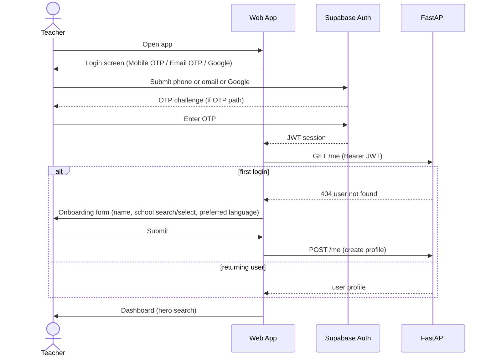
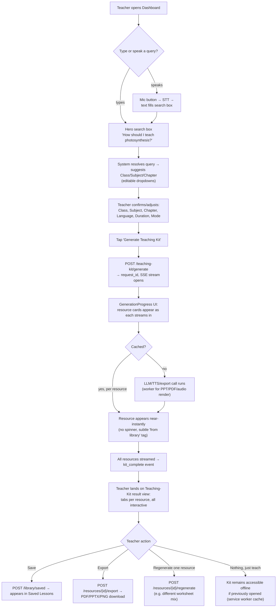
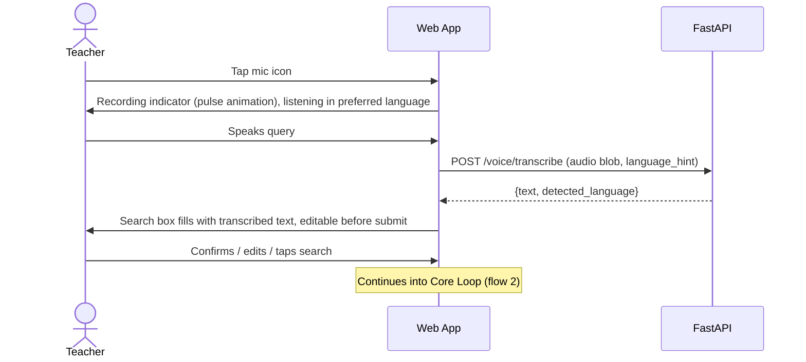
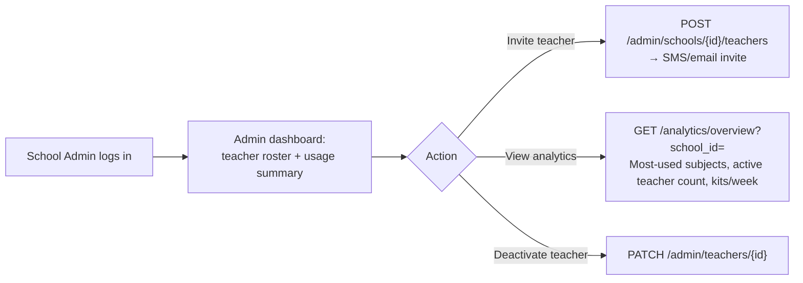

# User Flows

## 1. Onboarding & login

Design note: school selection is a searchable, pre-seeded list (from `schools`, UDISE-coded) — never a free-text field, so downstream admin/analytics scoping stays clean. If a teacher's school isn't found, they can flag it for `super_admin` review rather than self-creating a school record.

## 2. Core loop — generate a teaching kit (the product's central flow)

Key UX commitment: the teacher never sees a single blank "generating..." screen for the full pipeline duration. Each resource card individually resolves (cache hit = instant, cache miss = short generation state scoped to that one card), so perceived latency is the slowest *individual* resource, not the sum of all of them.

## 3. Cache hit vs miss — what the teacher actually experiences

| | Cache hit | Cache miss |
|---|---|---|
| Lesson plan card | Appears in <1s, "Ready" badge | Appears after LLM call (~3–6s), no badge |
| Worksheet card | Appears in <1s | Appears after generation + PDF render (~5–10s) |
| Audio card | Instant playback available | Progress bar while TTS renders, then playable |
| PPT card | Instant thumbnail preview | Outline generates, then thumbnails render progressively per slide |

No cache-hit/miss distinction is exposed as jargon to the teacher — only a subtle "Ready" vs. brief loading shimmer. Internally every event is logged to `analytics_events` (`cache_hit`/`cache_miss`) for the ops-facing effectiveness dashboard.

## 4. Voice input flow

If transcription confidence is low or `detected_language` disagrees with `preferred_language`, the UI shows the text with a "did we get this right?" affordance rather than silently proceeding — misheard chapter names are the single highest-cost error in this flow (wrong topic generated).

## 5. School admin flow

## 6. Super admin flow

Same shape as school admin, scoped platform-wide plus `admin/schools` CRUD and cross-school analytics — no separate flow diagram needed; it's flow 5 with `school_id` omitted and an additional Schools management screen.
